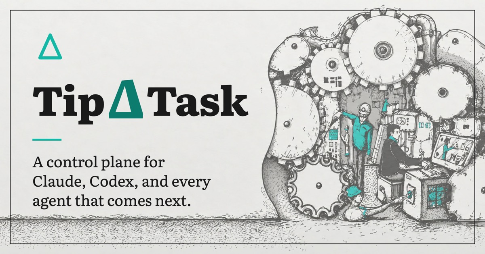

<p align="center">
  
</p>

# TipΔTask App

[](LICENSE)
[](https://github.com/Tipatask/tipatask/actions/workflows/test.yml)
[](https://github.com/Tipatask/tipatask/releases)

TipΔTask is a desktop app for working with AI coding agents. Plan your tasks on a board,
hand them to Claude, Codex or Pi, and watch the work happen in one place. It also keeps a
small knowledge base about your project, so agents start each task with real context instead
of rediscovering your codebase every time.

Created by Anton Matiienko and Apppixies — <https://tipatask.com>.

## Download

Grab the installer for your system from the
[latest release](https://github.com/Tipatask/tipatask/releases).

| System | File | How to install |
|---|---|---|
| macOS (Apple Silicon) | `TipATask-<version>-arm64.dmg` | Open it and drag TipATask to Applications. |
| macOS (Intel) | `TipATask-<version>-x64.dmg` | Same as above, using the x64 file. |
| Windows | `TipATask Setup <version>.exe` | Run the installer. |
| Linux (any distro) | `TipATask-<version>.AppImage` | Make it executable and run it. |
| Debian / Ubuntu | `tipatask-app_<version>_amd64.deb` | `sudo apt install ./<file>.deb` |
| Arch / Artix | `*.pkg.tar.*` | `sudo pacman -U ./<file>.pkg.tar.*` |

Linux builds need glibc 2.35 or newer. TipΔTask uses the `claude` and `codex` command-line
tools you already have, so install and sign in to the ones you want. Pi is included.

## Getting started

To run from source you need Node.js 22.19 or newer, npm 10 or newer, and a C/C++ build
toolchain (see [`ELECTRON_BUILD.md`](ELECTRON_BUILD.md) for your platform).

```bash
git clone https://github.com/Tipatask/tipatask.git
cd tipatask
nvm use
npm ci
npm run electron
```

Once the app is open, choose **Project ▸ Open / Create Project…** and pick your project
folder. TipΔTask signs you in, lets you pick or create a project, and adds the few files your
agents need. They are yours to edit, and reopening the project keeps them up to date. Tasks
are stored on <https://web.tipatask.com> by default; to use your own server, set
`API_BASE_URL` in the project's `.tipatask/config.json`.

To update, install a newer release (or pull and rebuild) and reopen your project.

## Build from source

Every installer in the [Download](#download) table is produced by
[electron-builder](https://www.electron.build) from the scripts in `package.json`. Output
lands in `dist-electron/`.

### Requirements

- **Node.js** `>=22.19.0` (`engines.node`; `.nvmrc` pins 22.22.1, so `nvm use` picks it up) and
  **npm** `>=10`. `npm ci` fails fast on an older Node (`preinstall` runs
  `scripts/check-node-version.js`).
- **A C/C++ toolchain**, because `node-pty` is a native module:
  Xcode Command Line Tools on macOS; Visual Studio Build Tools (C++ workload) and Python on
  Windows; `build-essential` and `python3` on Linux.
- **Linux only, for the pacman package:** `libarchive-tools` and `zstd`
  (`sudo apt-get install libarchive-tools zstd` on Debian/Ubuntu). AppImage and deb need nothing
  extra.

### What `npm ci` does

`postinstall` (`scripts/postinstall.js`) runs `electron-rebuild -f -w node-pty` so `node-pty`
matches Electron's ABI, marks `node-pty`'s `spawn-helper` executable (macOS/Linux), patches the
development Electron's name and icon (macOS only), and finally checks that npm installed the
right-platform `esbuild`. The rebuild is best effort: it only warns if it cannot run (for
example with `ELECTRON_SKIP_BINARY_DOWNLOAD=1`), but the `esbuild` check decides whether the
install succeeds.

### Packaging scripts

| Script | What it does |
|---|---|
| `npm run electron` | Build the client and open the app from source. No installer. |
| `npm run electron:pack` | Build an unpacked app directory (`electron-builder --dir`) for the OS and CPU you are on, for example `dist-electron/mac-arm64/TipATask.app` or `dist-electron/linux-unpacked/`. No installer, **does not change the version.** Fast smoke test. |
| `npm run electron:ci:mac` / `:win` / `:linux` | Stage the Pi and sherpa-onnx bundles, build the client, then package for that OS. **Does not change the version.** This is what CI runs. |
| `npm run electron:dist:mac` / `:win` / `:linux` | Same as `electron:ci:*`, but first bumps the patch version in `package.json` and `package-lock.json` (`scripts/bump-version.js`). |
| `npm run electron:dist` | The bumping build for macOS, Windows and Linux in one command. See the cross-build notes below before using it on a Mac. |

For a local installer you just want to try, use `electron:ci:*` so your working tree's version
stays put. Use `electron:dist:*` only when you mean to bump.

### macOS

```bash
nvm use
npm ci
npm run electron:ci:mac
```

Produces `dist-electron/TipATask-<version>-arm64.dmg` (Apple Silicon) and
`dist-electron/TipATask-<version>-x64.dmg` (Intel). Both architectures are built in one run.
The app is ad-hoc signed and not notarized, so macOS asks you to allow it on first launch
(**System Settings ▸ Privacy & Security ▸ Open Anyway**). Building the x64 dmg on an Apple
Silicon Mac rebuilds `node-pty` for Intel; if `node-gyp` fails with a missing `distutils`, point
`npm_config_python` at Python 3.11 or older (see [`ELECTRON_BUILD.md`](ELECTRON_BUILD.md)).

### Windows

```bash
nvm use
npm ci
npm run electron:ci:win
```

Produces `dist-electron/TipATask Setup <version>.exe` (NSIS one-click installer, x64). It is
unsigned, so SmartScreen warns on install. `nvm` itself is not available on Windows; install a
matching Node (for example with nvm-windows) before `npm ci`.

### Linux

```bash
nvm use
npm ci
npm run electron:ci:linux
```

Produces `dist-electron/TipATask-<version>.AppImage`, a `.deb`, and a pacman package
(`*.pkg.tar.*`), all x64. The official builds are compiled on Ubuntu 22.04, which sets the
glibc 2.35 floor mentioned above; a build on a newer distro needs a correspondingly newer glibc
to run.

### Cross-building Windows and Linux on a Mac

Short version: build each OS on that OS, and use GitHub Actions to do all three.

- **What works on a Mac.** The macOS dmgs (both architectures), and unpacked/unsigned output.
  Nothing here needs signing certificates.
- **What does not.** `node-pty` is a native module compiled per platform, and `node-gyp` cannot
  cross-compile it from macOS to Windows or Linux. Running `electron:ci:win`, `electron:ci:linux`
  or `electron:dist` on a Mac can therefore leave you with an installer whose terminal support is
  missing or broken. Treat that output as unsupported. The sherpa-onnx voice packages are not the
  problem: `scripts/stage-sherpa-bundle.js` installs the prebuilt package for every platform.
  The bundled Pi CLI is staged for the machine you build on, so it also belongs to the host.
- **Local fallbacks.** Build on a real Windows or Linux machine or VM. For Linux you can also run
  the same `npm ci` and `npm run electron:ci:linux` inside a Linux container (for example
  electron-builder's `electronuserland/builder` image, or an Ubuntu 22.04 image with the
  requirements above). This is an option, not a path the project tests.
- **Supported release path.** [`.github/workflows/build.yml`](.github/workflows/build.yml)
  ("Build installers") builds all three on native runners (`macos-latest`, `windows-latest`,
  `ubuntu-22.04`). It runs on a pushed `v*` tag, or manually from the Actions tab with
  **Run workflow**, where you can tick which of macOS, Windows and Linux to build. Each leg
  uploads its installers as a build artifact; a tag push also attaches them to a **draft**
  GitHub Release. The tag must match the `version` in `package.json`. See
  [`RELEASING.md`](RELEASING.md).

More: [`ELECTRON_BUILD.md`](ELECTRON_BUILD.md) for signing and distribution,
[`RELEASING.md`](RELEASING.md) for releases, [`CONTRIBUTING.md`](CONTRIBUTING.md) for
development.

## Project layout

Where things live, top level first. Paths marked *generated* are not committed.

```text
todo-server.js        Local HTTP/WebSocket server entry (port 4455)
build.js              esbuild bundler for the client (writes dist/)
main.js               Electron main process entry
main/                 Window, menu, IPC and notification helpers for main.js
preload.js            Renderer bridge exposed to the UI
src/
  client/             Browser UI: task board, objective chat, terminal console, notifications
  server/             WebSocket handlers, agent sessions, API backend, git merge, voice input
    task-agent/       Agent plugins (Claude, Codex, Pi) behind one BaseTaskAgent interface
    providers/        Objective-chat providers (Claude, Codex, Gemini, Pi) and dispatch
  cli/                Setup, sign-in and task import/export command-line tools
  mcp/                Local MCP server that gives agents task and knowledge-base tools
bin/                  mcp-node (Node version resolver) and the bundled pi launcher
scripts/              Postinstall, bundle staging, version bump, license notices, probes
vendor/
  pi/                 Staged Pi Coding Agent bundle (shipped outside the asar)
  voice-models/       Local speech models, downloaded on first use (not committed)
fixtures/             Recorded terminal output used by the attention-detection probes
templates/            Files written into a project when it is opened
assets/               App icons, splash and about pages
build/                macOS entitlements for packaging
docs/                 README images
dist/                 Client bundle (generated)
dist-electron/        Installers from the packaging scripts (generated)
```

Tests sit next to the code they cover as `*.test.js`; `npm test` runs them all. Per-module
design notes are kept by the maintainers in the parent repository's `ai/architecture/`
folder, which is not part of this repository.

## Contributing and security

Contributions are welcome — see [`CONTRIBUTING.md`](CONTRIBUTING.md). To report a
vulnerability, see [`SECURITY.md`](SECURITY.md).

## License

Apache License 2.0 — see [`LICENSE`](LICENSE). Copyright 2026 Anton Matiienko and Apppixies.

You're free to use, modify and fork TipΔTask, including commercially. Please keep the
[`NOTICE`](NOTICE) file and license with anything you distribute, and mark files you
changed. The TipΔTask and Tipatask names and logos aren't part of the license, so give your
fork its own name and credit the original, for example: *"Based on TipΔTask by Anton
Matiienko and Apppixies (https://github.com/Tipatask/tipatask)"*.

TipΔTask bundles the [Pi Coding Agent](https://github.com/earendil-works/pi) (MIT). Keep
[`THIRD-PARTY-NOTICES.md`](THIRD-PARTY-NOTICES.md) too — it credits every third-party
package in the app, and is also under **Help ▸ Third-Party Licenses**.
